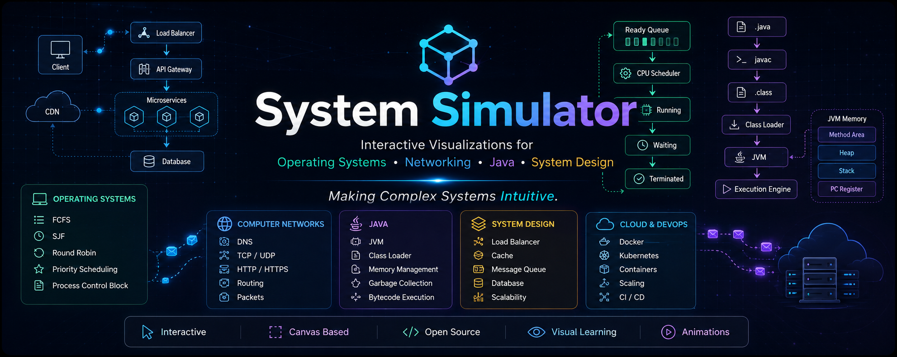

<div align="center">

<br />

<!-- PROJECT LOGO / HERO BANNER -->
<!-- Replace the placeholder below with your actual banner image -->
<!-- Recommended: 1280×640px PNG/SVG, dark background, project name + tagline -->
<!-- Place at: /public/banner.png -->



<br />

# System Simulator

### Visualize Computer Science.

**Transform abstract CS concepts into interactive, real-time visual experiences.**  
No more dry textbooks. No more static diagrams. Just understanding.

<br />

[](./LICENSE)
[](https://nextjs.org)
[](https://www.typescriptlang.org)
[](https://react.dev)
[](https://systemsimulator.vercel.app)
[](https://github.com/YOUR_USERNAME/system-simulator/stargazers)
[](https://github.com/YOUR_USERNAME/system-simulator/issues)

<br />

[**🚀 Live Demo**](https://systemsimulator.vercel.app) ·
 <!-- [**📖 Documentation**](#-usage-guide) · [**🤝 Contribute**](#-contributing) · [**🗺 Roadmap**](#-roadmap) -->

<br />
<br />

</div>

---

## The Problem

Computer Science is built on ideas that are fundamentally visual — yet we teach them with text.

> A process scheduler doesn't "select the next thread." It *reaches into a priority queue*, *picks a thread*, *saves the current CPU context*, and *restores the next one* — all in microseconds, in an order that changes dynamically.

No amount of reading explains that as clearly as *watching it happen*.

The standard approach to learning CS — textbooks, static diagrams, lecture slides — forces students to mentally simulate systems that were designed to be observed. This creates a gap between *knowing the definition* and *understanding the behavior*.

**System Simulator closes that gap.**

It takes the most important, most counterintuitive concepts in Computer Science and renders them as living, interactive systems that you can pause, rewind, and explore step by step.

---

## Demo

<div align="center">

<!-- DEMO GIF -->
<!-- Replace the placeholder below with your actual demo GIF -->
<!-- Recommended: Record a 30–60s walkthrough using a screen recorder (e.g., LICEcap, Kap, or OBS) -->
<!-- Export as a GIF or MP4, optimized for size (<5MB recommended) -->
<!-- Place at: /public/demo.gif -->


<br />

*Simulating Processing Scheduling Algorithms in Operating Systems.*

<br />
</div>

---

## Why It Exists

Learning Computer Science at university is paradoxical.

You spend years studying systems that are invisible by nature — operating systems, virtual machines, networks, distributed systems — using tools that offer no visibility at all. You are handed a textbook diagram of the JVM and told to trust it. You are shown a network packet header and asked to imagine it traveling across routers.

Visualization tools exist, but they are either toy-grade, platform-locked, or so far removed from production reality that they teach the wrong mental model.

System Simulator was built to be different:

- **Faithful to reality** — simulations mirror actual system behavior, not simplified analogies
- **Interactive by design** — every simulation is a system you control, not a video you watch
- **Incrementally deep** — concepts unfold step by step so understanding builds naturally
- **Accessible everywhere** — runs in any browser, on any device, with zero installation

The goal is not to replace formal education. It is to give students the visual intuition that makes formal learning stick.

---

## Features

### Core Experience

| Feature | Description |
|---|---|
| 🎬 **Step-by-step playback** | Walk through any simulation one step at a time, or let it run automatically |
| ⏸ **Pause & Inspect** | Freeze execution at any moment to examine system state in detail |
| 🔁 **Rewind & Replay** | Go back to any previous step without restarting the simulation |
| 📝 **Live annotations** | Explanatory callouts update in real time as the simulation progresses |
| 🌙 **Dark mode first** | Designed for long study sessions with a carefully tuned dark theme |

### Platform & Accessibility

| Feature | Description |
|---|---|
| ⚡ **Zero installation** | Open a browser, start learning — no setup, no accounts, no friction |
| 📱 **Responsive layout** | Optimized for desktop study and tablet review sessions |
| 🔗 **Shareable state** | Link directly to a specific simulation step (coming soon) |
| ♿ **Accessible design** | WCAG-compliant color contrast and keyboard navigation |

### Developer Experience

| Feature | Description |
|---|---|
| 🧩 **Modular simulation engine** | Each simulation is a self-contained, data-driven scenario |
| 🔧 **TypeScript throughout** | End-to-end type safety with strict configuration |
| 🚀 **Vercel Edge deployment** | Sub-100ms response times globally via Edge Network |
| 🧪 **Extensible architecture** | Add new simulations without touching the core engine |

---

## Interactive Simulations

### Currently Available

| Simulation | Topic | Concepts Covered | Status |
|---|---|---|---|
| **Java Flow of Execution** | Java Fundamentals | Source code → bytecode → JVM execution lifecycle | ✅ Live |
| **Platform Independence** | Java / JVM | Write Once Run Anywhere, bytecode portability, OS abstraction | ✅ Live |
| **JVM Class Loading** | JVM Internals | Bootstrap → Extension → Application classloader chain | ✅ Live |

### On the Roadmap

<details>
<summary><b>Operating Systems</b></summary>

| Simulation | Concepts |
|---|---|
| CPU Scheduling | Round Robin, FCFS, Priority, Multilevel Queue |
| Memory Management | Paging, Segmentation, Page Table Walk |
| Virtual Memory | Page Faults, LRU/FIFO/Optimal replacement |
| Process Synchronization | Semaphores, Mutexes, Deadlock Detection |
| File System | Inode structure, Directory tree, Block allocation |
| System Calls | User mode → Kernel mode transition |

</details>

<details>
<summary><b>Computer Networks</b></summary>

| Simulation | Concepts |
|---|---|
| DNS Resolution | Recursive vs. Iterative lookup, Root → TLD → Authoritative |
| TCP Handshake | SYN / SYN-ACK / ACK, Connection teardown |
| HTTP Request Lifecycle | Browser → DNS → TCP → Server → Response |
| TCP/IP Stack | Encapsulation across OSI layers |
| Load Balancing | Round Robin, Least Connections, IP Hash |
| CDN Mechanics | Cache hit/miss, Edge node routing |

</details>

<details>
<summary><b>Databases</b></summary>

| Simulation | Concepts |
|---|---|
| B-Tree Index | Node splits, Key lookup, Range scan |
| Query Execution | Parse → Plan → Optimize → Execute |
| ACID Transactions | Atomicity, Isolation levels, Rollback |
| Connection Pooling | Pool exhaustion, Queue behavior |

</details>

<details>
<summary><b>Distributed Systems</b></summary>

| Simulation | Concepts |
|---|---|
| Raft Consensus | Leader election, Log replication, Split votes |
| Consistent Hashing | Node addition/removal, Virtual nodes |
| Distributed Caching | Cache invalidation, Write-through vs. Write-back |
| Message Queues | Producer → Consumer, Dead letter queues |

</details>

<details>
<summary><b>Infrastructure</b></summary>

| Simulation | Concepts |
|---|---|
| Docker Layers | Image build, Layer caching, Container lifecycle |
| Kubernetes Pod Scheduling | Node scoring, Resource limits, Eviction |
| Service Mesh | Sidecar proxy, mTLS, Circuit breaker |
| CI/CD Pipeline | Build → Test → Deploy → Rollback |

</details>

---

## Project Structure

```
system-simulator/
│
├── app/                          # Next.js App Router pages
│   ├── (home)/                   # Landing page route group
│   ├── simulations/              # Simulation browser
│   │   └── [slug]/               # Dynamic simulation routes
│   └── layout.tsx                # Root layout (fonts, providers, metadata)
│
├── components/                   # Reusable UI components
│   ├── ui/                       # Design system primitives (Button, Card, Badge…)
│   ├── simulation/               # Simulation-specific components
│   │   ├── SimulationCanvas.tsx  # React Flow canvas wrapper
│   │   ├── StepControls.tsx      # Play / Pause / Step / Reset controls
│   │   ├── AnnotationOverlay.tsx # Live step annotations
│   │   └── SimulationCard.tsx    # Simulation browser card
│   └── layout/                   # Header, Footer, Navigation
│
├── scenarios/                    # 🔑 Simulation data definitions
│   ├── java-flow-of-execution/   # Step-by-step scenario data
│   ├── platform-independence/
│   └── jvm-class-loading/
│
├── hooks/                        # Custom React hooks
│   ├── useSimulation.ts          # Core simulation state machine
│   ├── useStepPlayer.ts          # Auto-play with configurable speed
│   └── useAnimationSync.ts       # Framer Motion ↔ React Flow bridge
│
├── lib/                          # Utilities and shared logic
│   ├── simulation-engine.ts      # Step dispatcher and state resolver
│   ├── node-factory.ts           # Node/edge builders for React Flow
│   └── utils.ts                  # General helpers
│
├── types/                        # TypeScript type definitions
│   ├── simulation.ts             # Scenario, Step, Node, Edge types
│   └── ui.ts                     # Component prop types
│
├── public/                       # Static assets
│   ├── banner.png                # README hero banner
│   ├── demo.gif                  # README demo GIF
│   └── screenshots/              # README screenshots
│
└── styles/                       # Global CSS and Tailwind config
    └── globals.css
```

---

## Getting Started

### Prerequisites

Ensure you have the following installed:

```
Node.js   >= 18.17.0
npm       >= 9.0.0   (or pnpm / yarn)
```

### Installation

**1. Clone the repository**

```bash
git clone https://github.com/YOUR_USERNAME/system-simulator.git
cd system-simulator
```

**2. Install dependencies**

```bash
npm install
```

**3. Set up environment variables**

```bash
cp .env.example .env.local
```

```env
# .env.local
NEXT_PUBLIC_APP_URL=http://localhost:3000
```

**4. Start the development server**

```bash
npm run dev
```

Open [http://localhost:3000](http://localhost:3000) in your browser.

---

## Running Locally

| Command | Description |
|---|---|
| `npm run dev` | Start development server with hot reload |
| `npm run build` | Build optimized production bundle |
| `npm run start` | Start production server |
| `npm run lint` | Run ESLint across the codebase |
| `npm run type-check` | Run TypeScript compiler in check mode |

> **Tip:** The development server supports Fast Refresh — component state is preserved across edits.

---

## Usage Guide

### Exploring a Simulation

1. **Open the app** at [systemsimulator.vercel.app](https://systemsimulator.vercel.app)
2. **Browse the simulation library** on the homepage
3. **Select a simulation** — each card shows the topic and estimated duration
4. **Use the step controls** at the bottom of the canvas:
   - **▶ Play** — auto-advance through all steps
   - **⏸ Pause** — freeze at the current step
   - **→ Next** — advance one step manually
   - **← Back** — go to the previous step
   - **↺ Reset** — return to the beginning
5. **Read the annotation panel** — each step includes a plain-English explanation of what is happening and why
6. **Slow it down** — use the speed control to step through at your own pace

### For Educators

Each simulation is designed to supplement a lecture, not replace it. Use the **step-by-step mode** to walk a class through a concept while narrating the explanation. The visual state of the system changes with every step, making it easy to point to exactly what is happening.

### For Interview Preparation

The simulations cover topics that appear frequently in system design and CS fundamentals interviews — Java Internals, JavaScript Internals, Operating Systems and more coming soon. Step through them the day before an interview to sharpen your mental model.

---

## Performance

System Simulator is built to load fast and stay fast.

| Metric | Target | Approach |
|---|---|---|
| **First Contentful Paint** | < 1.2s | React Server Components, zero client JS on first paint |
| **Time to Interactive** | < 2.0s | Code splitting per simulation route |
| **Bundle Size** | Minimized | Tree-shaken imports, dynamic imports for React Flow |
| **Edge Delivery** | Global | Vercel Edge Network, static asset CDN |
| **Animation Performance** | 60 fps | CSS transforms, `will-change`, hardware acceleration |

Simulations are loaded as isolated route segments — opening the app does not load simulation data until it is needed.

---

## Design Philosophy

System Simulator is built on three educational principles:

**1. Show, don't tell.**
Every concept that can be visualized, should be. Text explains what something is. Visualization shows how it behaves. The goal is always to show behavior, not just name it.

**2. Control belongs to the learner.**
Passive video is a poor learning tool for complex systems. When you control the pace — when you can pause, rewind, and re-examine — understanding deepens. Every simulation is fully interactive by default.

**3. Fidelity over simplification.**
It is tempting to simplify systems to make them easier to animate. System Simulator resists this. The JVM class loading simulation reflects the actual Bootstrap → Extension → Application classloader delegation model. Simplification is a last resort, not a first instinct. Students who build accurate mental models learn faster and forget less.

---

## Contributing

Contributions are welcome and deeply appreciated. Whether you are adding a new simulation, improving an existing one, fixing a bug, or improving documentation — every contribution matters.

### Reporting Issues

Found a bug or have a feature request?  
[Open an issue](https://github.com/TheMikeKaisen/system-simulator/issues) with a clear title and as much context as possible.

---

## License

Distributed under the **MIT License**.  
See [LICENSE](./LICENSE) for the full text.

---

## Acknowledgements

System Simulator is built on the shoulders of excellent open-source work:

- **[React Flow](https://reactflow.dev)** — the graph canvas that powers every simulation
- **[Framer Motion](https://www.framer.com/motion/)** — fluid, physics-based animations
- **[Next.js](https://nextjs.org)** — the framework that makes this feel instant
- **[Vercel](https://vercel.com)** — effortless global deployment
- **[Tailwind CSS](https://tailwindcss.com)** — utility-first styling at scale
- **[Shields.io](https://shields.io)** — dynamic status badges

Inspired by the visual learning philosophy of [CS Visualized](https://dev.to/lydiahallie) by Lydia Hallie and the interactivity of [Nand to Tetris](https://www.nand2tetris.org/).

---

## Contact

<div align="center">

Built with purpose by **[Your Name](https://karthik-h-nair.vercel.app)**

[](https://github.com/YOUR_USERNAME)

[](https://linkedin.com/in/karthik-h-nair)

Have an idea for a simulation? Want to collaborate?  
Open an issue or reach out directly — ideas are always welcome.

<br />

---

<br />

*If System Simulator helped you understand something that a textbook couldn't — consider giving it a ⭐*

*Stars help other students find this tool.*

<br />

</div>
