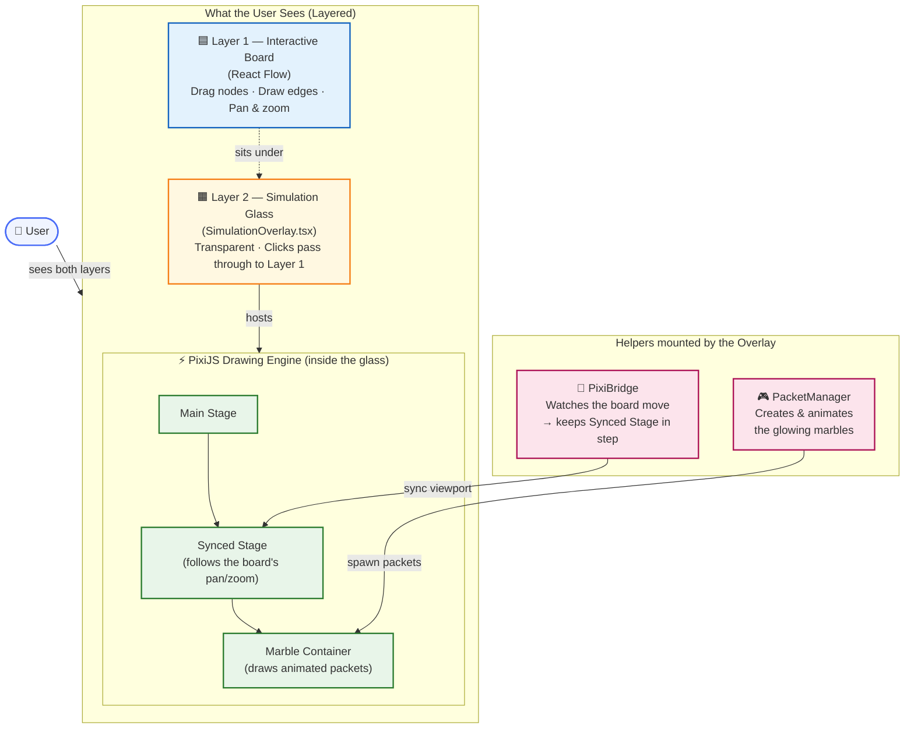

1. The Container Hierarchy
The lines create a nested structure:

app.stage (Root): The top-level PixiJS stage.
syncedStage (Middle): A "wrapper" layer. This is the most critical part—it gets moved and scaled by the PixiBridge to perfectly match your React Flow board as you pan or zoom.
packetsContainer (Child): A dedicated layer for all the "marbles" (packets).

2. Why this matters (Significance)
Automatic Movement: Because the packetsContainer is a child of the syncedStage, you don't have to manually calculate where every packet should be when you zoom out. You just move the syncedStage, and all the packets inside it move along with it automatically.
Layer Isolation: By keeping packets in their own packetsContainer, the engine can manage them independently. If you later added a "HUD" or "Legend" that shouldn't move when you pan the board, you would add it directly to app.stage instead of syncedStage.
Global Access: setPacketStage(syncedStage) (Line 41) saves this container to a global state (likely the useSimulationStore). This allows other components—specifically the PacketManager—to "find" the stage and start injecting animated packets into it without needing to know how PixiJS was initialized.
In short: These lines create the "Transparent Glass" that sits over your diagram and ensures that anything drawn on that glass stays perfectly pinned to the boxes and lines underneath it.

