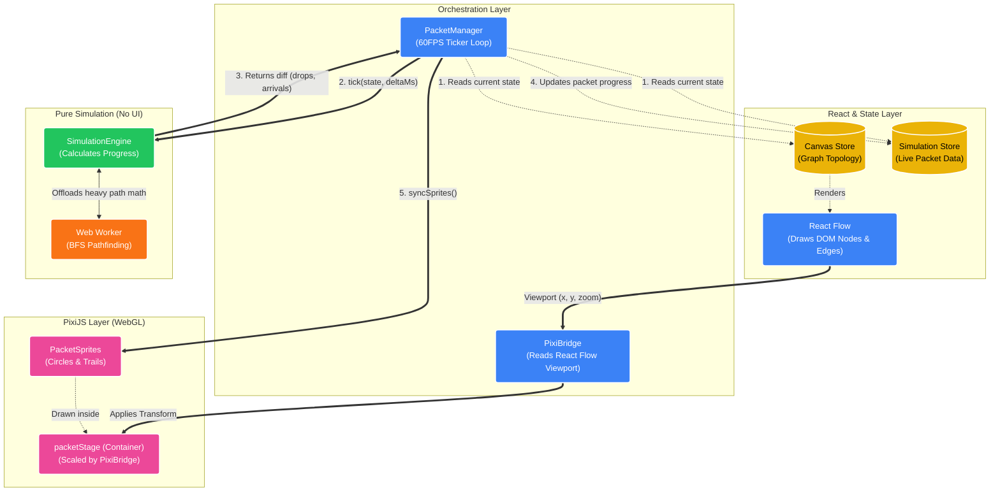

# Simulation Architecture Diagram

This diagram visualizes how the different layers of the application—React Flow, Zustand, the core simulation engine, and PixiJS—interact with one another via the `PacketManager`.

## How to read this diagram:

1. **State & React (Top)**: Zustand holds the single source of truth. React Flow just reads the graph topology to draw the boxes.
2. **The 60FPS Loop (Middle)**: The `PacketManager` is the brain of the loop. Every frame (~16ms), it pulls data from the stores and gives it to the `SimulationEngine`.
3. **Pure Logic**: The `SimulationEngine` uses math to figure out where packets should be. It offloads heavy pathfinding to the `Web Worker` so the main thread doesn't freeze. It hands a "diff" back to the manager.
4. **Visuals (Bottom)**: The manager writes the diff to Zustand, then tells the PixiJS `PacketSprites` to move to their new coordinates. `PixiBridge` guarantees that the Pixi canvas lines up perfectly over the React Flow canvas.
