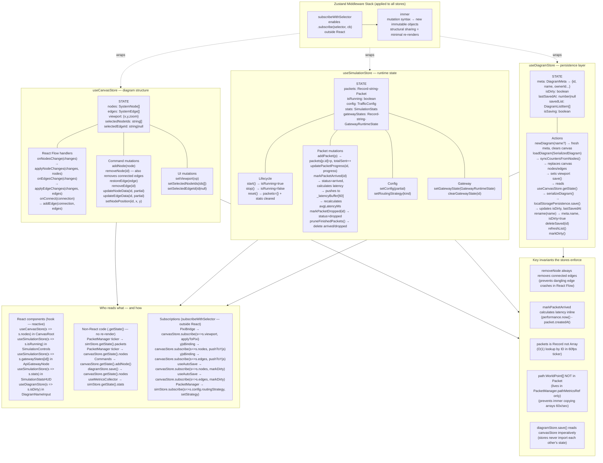

```mermaid
flowchart TB
    subgraph MIDDLEWARE["Zustand Middleware Stack (applied to all stores)"]
        direction LR
        M1["subscribeWithSelector<br/>enables .subscribe(selector, cb)<br/>outside React"] --> M2["immer<br/>mutation syntax → new immutable objects<br/>structural sharing = minimal re-renders"]
    end
 
    subgraph CS["useCanvasStore — diagram structure"]
        direction TB
        CS_STATE["STATE<br/>nodes: SystemNode[]<br/>edges: SystemEdge[]<br/>viewport: {x,y,zoom}<br/>selectedNodeIds: string[]<br/>selectedEdgeId: string|null"]
        CS_RF["React Flow handlers<br/>onNodesChange(changes)<br/>→ applyNodeChanges(changes, nodes)<br/>onEdgesChange(changes)<br/>→ applyEdgeChanges(changes, edges)<br/>onConnect(connection)<br/>→ addEdge(connection, edges)"]
        CS_CMD["Command mutations<br/>addNode(node)<br/>removeNode(id) — also removes connected edges<br/>restoreEdge(edge)<br/>removeEdge(id)<br/>updateNodeData(id, partial)<br/>updateEdgeData(id, partial)<br/>setNodePosition(id, x, y)"]
        CS_UI["UI mutations<br/>setViewport(vp)<br/>setSelectedNodeIds(ids[])<br/>setSelectedEdgeId(id|null)"]
        CS_STATE --- CS_RF
        CS_STATE --- CS_CMD
        CS_STATE --- CS_UI
    end
 
    subgraph SS["useSimulationStore — runtime state"]
        direction TB
        SS_STATE["STATE<br/>packets: Record-string-Packet<br/>isRunning: boolean<br/>config: TrafficConfig<br/>stats: SimulationStats<br/>gatewayStates: Record-string-GatewayRuntimeState"]
        SS_LIFE["Lifecycle<br/>start() → isRunning=true<br/>stop()  → isRunning=false<br/>reset() → packets={} + stats cleared"]
        SS_PKT["Packet mutations<br/>addPacket(p) → packets[p.id]=p, totalSent++<br/>updatePacketProgress(id, progress)<br/>markPacketArrived(id)<br/>  → status=arrived, calculates latency<br/>  → pushes to _latencyBuffer[60]<br/>  → recalculates avgLatencyMs<br/>markPacketDropped(id) → status=dropped<br/>pruneFinishedPackets() → delete arrived/dropped"]
        SS_CFG["Config<br/>setConfig(partial)<br/>setRoutingStrategy(kind)"]
        SS_GW["Gateway<br/>setGatewayState(GatewayRuntimeState)<br/>clearGatewayState(id)"]
        SS_STATE --- SS_LIFE
        SS_STATE --- SS_PKT
        SS_STATE --- SS_CFG
        SS_STATE --- SS_GW
    end
 
    subgraph DS["useDiagramStore — persistence layer"]
        direction TB
        DS_STATE["STATE<br/>meta: DiagramMeta → {id, name, ownerId...}<br/>isDirty: boolean<br/>lastSavedAt: number|null<br/>savedList: DiagramListItem[]<br/>isSaving: boolean"]
        DS_ACT["Actions<br/>newDiagram(name?) → fresh meta, clears canvas<br/>loadDiagram(SerializedDiagram)<br/>  → syncCountersFromNodes()<br/>  → replaces canvas nodes/edges<br/>  → sets viewport<br/>save()<br/>  → reads useCanvasStore.getState()<br/>  → serializeDiagram()<br/>  → localStoragePersistence.save()<br/>  → updates isDirty, lastSavedAt<br/>rename(name) → meta.name, isDirty=true<br/>deleteSaved(id)<br/>refreshList()<br/>markDirty()"]
        DS_STATE --- DS_ACT
    end
 
    subgraph CONSUMERS["Who reads what — and how"]
        direction TB
        REACT["React components (hook — reactive)<br/>useCanvasStore(s => s.nodes) in CanvasRoot<br/>useSimulationStore(s => s.isRunning) in SimulationControls<br/>useSimulationStore(s => s.gatewayStates[id]) in ApiGatewayNode<br/>useSimulationStore(s => s.stats) in SimulationStatsHUD<br/>useDiagramStore(s => s.isDirty) in DiagramNameInput"]
        IMPERATIVE["Non-React code (.getState() — no re-render)<br/>PacketManager ticker → simStore.getState().packets<br/>PacketManager ticker → canvasStore.getState().nodes<br/>Commands → canvasStore.getState().addNode()<br/>diagramStore.save() → canvasStore.getState().nodes<br/>useMetricsCollector → simStore.getState().stats"]
        SUBSCRIBE["Subscriptions (subscribeWithSelector — outside React)<br/>PixiBridge → canvasStore.subscribe(s=>s.viewport, applyToPixi)<br/>yjsBinding → canvasStore.subscribe(s=>s.nodes, pushToYjs)<br/>yjsBinding → canvasStore.subscribe(s=>s.edges, pushToYjs)<br/>useAutoSave → canvasStore.subscribe(s=>s.nodes, markDirty)<br/>useAutoSave → canvasStore.subscribe(s=>s.edges, markDirty)<br/>PacketManager → simStore.subscribe(s=>s.config.routingStrategy, setStrategy)"]
    end
 
    subgraph INVARIANTS["Key invariants the stores enforce"]
        I1["removeNode always removes connected edges<br/>(prevents dangling edge crashes in React Flow)"]
        I2["markPacketArrived calculates latency inline<br/>(performance.now() - packet.createdAt)"]
        I3["packets is Record not Array<br/>(O(1) lookup by ID in 60fps ticker)"]
        I4["path:WorldPoint[] NOT in Packet<br/>(lives in PacketManager.pathMetricsRef only)<br/>(prevents immer copying arrays 60x/sec)"]
        I5["diagramStore.save() reads canvasStore imperatively<br/>(stores never import each other's state)"]
    end
 
    MIDDLEWARE -.->|wraps| CS
    MIDDLEWARE -.->|wraps| SS
    MIDDLEWARE -.->|wraps| DS
    CS --> CONSUMERS
    SS --> CONSUMERS
    DS --> CONSUMERS
    CS --> INVARIANTS
    SS --> INVARIANTS
    DS --> INVARIANTS
```