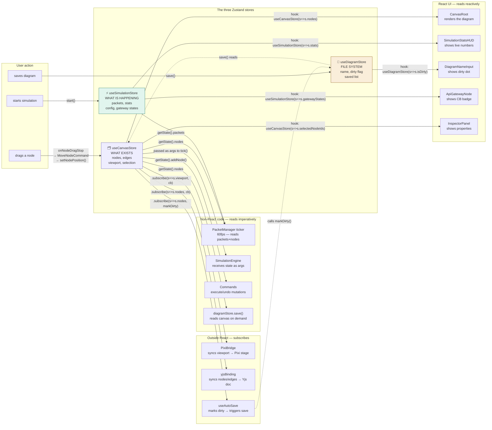

```mermaid
flowchart LR
    subgraph USER["User action"]
        U1["drags a node"]
        U2["starts simulation"]
        U3["saves diagram"]
    end
 
    subgraph STORES["The three Zustand stores"]
        CS["🗂 useCanvasStore<br/>WHAT EXISTS<br/>nodes, edges<br/>viewport, selection"]
        SS["⚡ useSimulationStore<br/>WHAT IS HAPPENING<br/>packets, stats<br/>config, gateway states"]
        DS["💾 useDiagramStore<br/>FILE SYSTEM<br/>name, dirty flag<br/>saved list"]
    end
 
    subgraph REACT["React UI — reads reactively"]
        R1["CanvasRoot<br/>renders the diagram"]
        R2["SimulationStatsHUD<br/>shows live numbers"]
        R3["DiagramNameInput<br/>shows dirty dot"]
        R4["ApiGatewayNode<br/>shows CB badge"]
        R5["InspectorPanel<br/>shows properties"]
    end
 
    subgraph IMPERATIVE["Non-React code — reads imperatively"]
        P1["PacketManager ticker<br/>60fps — reads packets+nodes"]
        P2["SimulationEngine<br/>receives state as args"]
        P3["Commands<br/>execute/undo mutations"]
        P4["diagramStore.save()<br/>reads canvas on demand"]
    end
 
    subgraph OUTSIDE["Outside React — subscribes"]
        O1["PixiBridge<br/>syncs viewport → Pixi stage"]
        O2["yjsBinding<br/>syncs nodes/edges → Yjs doc"]
        O3["useAutoSave<br/>marks dirty → triggers save"]
    end
 
    U1 -->|"onNodeDragStop<br/>→ MoveNodeCommand<br/>→ setNodePosition()"| CS
    U2 -->|"start()"| SS
    U3 -->|"save()"| DS
 
    CS -->|"hook: useCanvasStore(s=>s.nodes)"| R1
    CS -->|"hook: useCanvasStore(s=>s.selectedNodeIds)"| R5
    SS -->|"hook: useSimulationStore(s=>s.stats)"| R2
    SS -->|"hook: useSimulationStore(s=>s.gatewayStates)"| R4
    DS -->|"hook: useDiagramStore(s=>s.isDirty)"| R3
 
    CS -->|".getState().nodes"| P1
    SS -->|".getState().packets"| P1
    CS -->|"passed as args to tick()"| P2
    CS -->|".getState().addNode()"| P3
    CS -->|".getState().nodes"| P4
 
    CS -->|".subscribe(s=>s.viewport, cb)"| O1
    CS -->|".subscribe(s=>s.nodes, cb)"| O2
    CS -->|".subscribe(s=>s.nodes, markDirty)"| O3
 
    DS -.->|"save() reads"| CS
    O3 -.->|"calls markDirty()"| DS
 
    style CS fill:#EEEDFE,stroke:#534AB7
    style SS fill:#E1F5EE,stroke:#0F6E56
    style DS fill:#FAEEDA,stroke:#854F0B
```